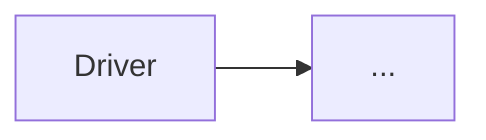
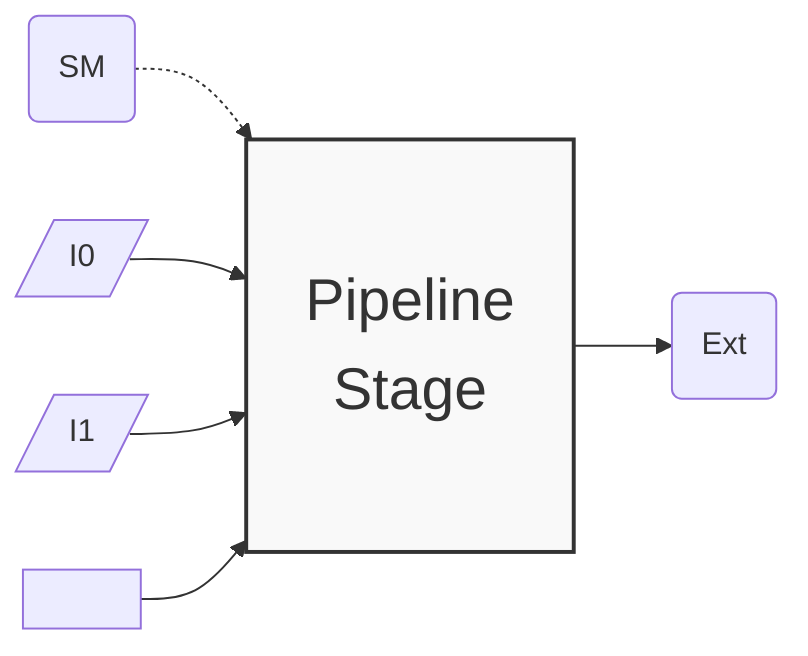

# Pipelined Architecture Generated by Assassyn

Assassyn aims at making CI test cases also self examplified.

There are three key test cases, which covers more than 95%
of Assassyn's core functionality.

# Driver Module

[test_driver.py](../../python/ci-tests/test_driver.py) is an example of the `Driver`,
a special module of a pipeline stage. This module is like the "main" function
entrance in software and the "clock" of a verilog system.
The driver is unconditionally activated each cycle to execute
the logic inside and drive the next stages.

## Pipeline Stage

- [test_async_call.py](../../python/ci-tests/test_async_call.py): This discusses the key pipeline
  model of Assassyn, how two pipeline stages communicate.
- [test_downstream.py](../../python/ci-tests/test_downstream.py): This discusses how cross-module
  same-cycle communications are done.
